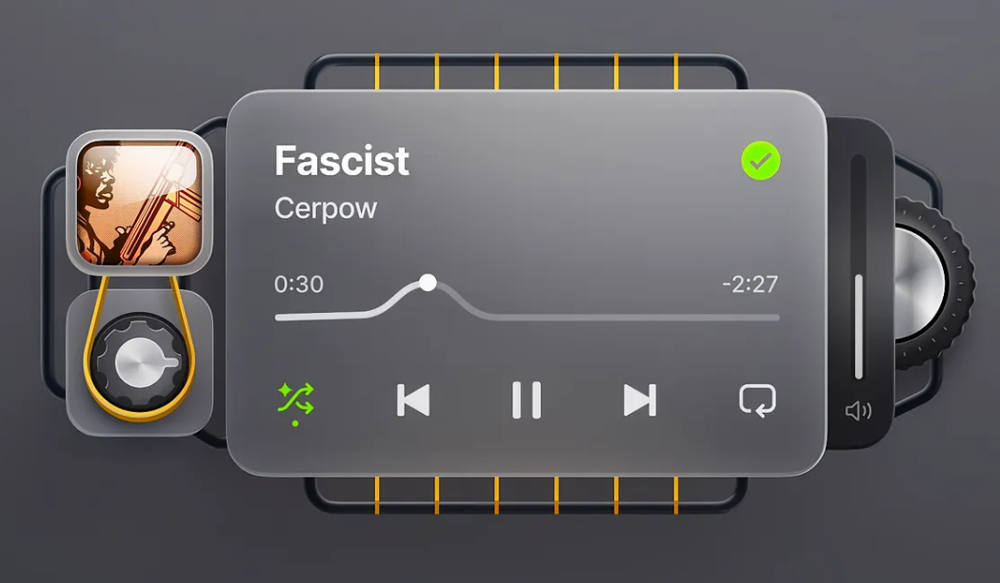

# glassmorphic_audio_player
This project explores the design of a modern music player interface using the glassmorphism UI style. It's a conceptual design, inspired by the provided image, focusing on clean aesthetics and user experience.

<a href="https://www.figma.com/design/pwPUigfnigjIrDbkPcl6Nc/glassmorphic-audio-player?node-id=0-1&p=f&t=p8qyUCjNs9WnvOTZ-0">glassmorphic audio player UI</a>
